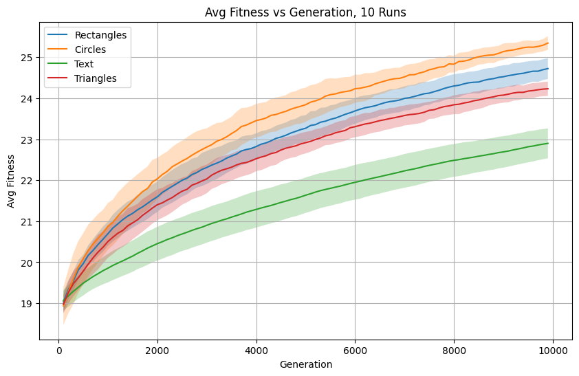
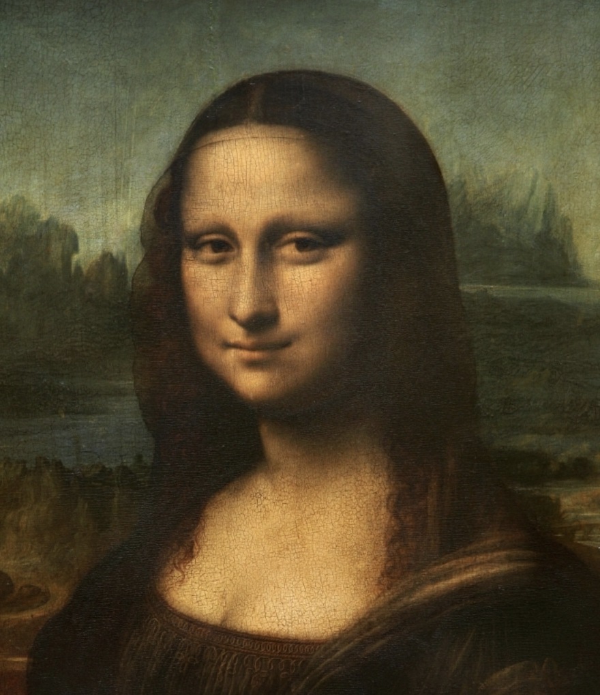

# Genetic Algorithm for Image Reconstruction
## Intro

Genetic algorithm implementation to approximate a target image by composing it with simple geometric shapes such as triangles, circles, rectangles, lines and characters.
It evoleves images by iteratively change the properties of the shapes (how many, position, color, size) to minimize the difference between the reconstructed image and the original target image.

## Requirements

```
pip install -r requirements.txt
```

* scikit-image
* imageio
* numpy
* opencv-python
* Pillow
* scikit-image
* matplotlib

## Algorithm details
### Population
Pupulation size of 50 where an individual is represented as an 256x256x3 RGB image.

### Fitness Function
For measuring image similarity i used the Peak Signal-to-Noise ratio metric. It is calculated as:

$$
\text{PSNR} = 10 \cdot \log_{10} \left( \frac{\text{MAX}^2}{\text{MSE}} \right)
$$


Where:
- **MAX**: Maximum possible pixel value (255 for 8-bit images).
- **MSE**: Mean Squared Error, defined as:
  
$$
\text{MSE} = \frac{1}{H \cdot W} \sum_{x=1}^{H} \sum_{y=1}^{W} \left( I_t(x, y) - I_r(x, y) \right)^2
$$

## Selection Type
Tournament selection with size starting from 2 and gradually increases, as the number of generation goes on, up to 10.

## Crossover
Different categories of crossovers:
* First category: randomly choose a row/column, everithing up to that row/column is from one parent the rest is from the other. Randomly select half of the rows/columns of an inidvidual and swap them between the parents. I assigned an equal probability to all of this crossover inside the category.
* Second category: blending, that is combining two images(parents) into a single image(child) by mixing their pixel values.
* Third category: for each pixel of the child randomly choose between one of the parents.

Overall crossover probability equal to 0.8 with a probability of 0.2, 0.3, 0.5 for the different categories respectively.

## Mutation
Two types of mutation:
* Adding a shape of random color, size and position
* Adding a random value to a subset of the pixels.

Overall mutation probability equal to 0.2, 0.9 for the first type 0.1 for the second one.

## Results
I run the algorithm for 10k generation and calculate the fitness in order to see which one of the shapes will better approximate the target image, the mona lisa in my case.




I also created some gifs of the evolution:


  
